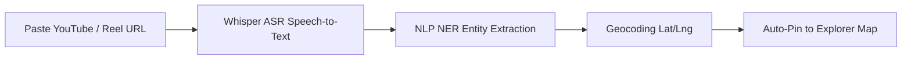

# 🧪 How to Test the YouTube & Video NLP Location Scraper

This guide provides step-by-step instructions for testing the **AI YouTube Foodie Video Scraper & NLP Location Extraction Engine** in **Hidden Eats**, both via the **Web UI** and directly through **REST API endpoints**.

---

## 🎯 What the Scraper Does



1. **Audio & Caption Ingestion**: Downloads audio streams and subtitles from food vlogger video links.
2. **OpenAI Whisper ASR**: Transcribes spoken speech (Tamil, Tanglish, English, Hindi).
3. **SpaCy / Transformer NER**: Extracts shop name, landmark street, signature dish, and price range.
4. **Geocoding & Confidence Scoring**: Resolves `(latitude, longitude)` coordinates with a confidence score (0.0 to 1.0).
5. **Instant Live Mapping**: Pins the newly discovered hidden gem directly onto the dark MapLibre map.

---

## 🖥️ Method 1: Testing via the Web UI (Recommended)

### Step 1: Start the Development Server
Ensure the Next.js web application is running:
```powershell
cd "c:\Hidden Eats"
npm run dev
```
Open your browser and navigate to:  
👉 **[http://localhost:3000/explorer/map](http://localhost:3000/explorer/map)**

---

### Step 2: Open the Scraper Modal
1. Look at the top-left search overlay on the map.
2. Click the **"NLP Scraper"** button (with the red YouTube icon).
3. The **AI YouTube Scraper & Hidden Shop Extractor** modal will open with a dark glassmorphic UI.

---

### Step 3: Paste a Test Video Link
You can use any standard YouTube video URL, YouTube Short, or Instagram Reel link:

**Sample Test URLs:**
- `https://www.youtube.com/watch?v=dQw4w9WgXcQ`
- `https://youtu.be/xPY919x8A9`
- `https://www.youtube.com/shorts/zP91x7A0L1`
- `https://instagram.com/reel/C89abcdef`

---

### Step 4: Run Extraction
1. Click **"Extract Spot"** (or press Enter).
2. Watch the live 4-stage AI pipeline progress:
   - `1/4: Downloading YouTube audio stream & captions...`
   - `2/4: Running OpenAI Whisper ASR speech-to-text model...`
   - `3/4: SpaCy NER Transformer extracting shop name, address & dishes...`
   - `4/4: Geocoding address & calculating NLP confidence score...`

---

### Step 5: Verify Extracted Data & Pin to Map
Once extraction completes, verify the card details:
- **Shop Name**: e.g., *Sri Balaji Mutton Mess*
- **Location**: e.g., *No. 14, Triplicane High Road, Chennai*
- **Signature Dish**: e.g., *Seeraga Samba Mutton Biryani & Brain Fry*
- **Confidence Score**: e.g., `94% AI Confidence` with verified badge.
- Click **"Pin to Explorer Map ↗"**:
  - The modal will close.
  - The newly extracted food gem will be dynamically added and pinned to the **MapLibre canvas**.
  - Selecting it will recalculate the live **OSRM driving route line**!

---

## ⚡ Method 2: Testing via API Endpoints (Terminal / cURL / Postman)

### 1. Fetch All Scraped Hidden Spots (`GET`)

**PowerShell Command:**
```powershell
Invoke-RestMethod -Uri "http://localhost:3000/api/scrape-youtube" -Method GET | ConvertTo-Json -Depth 5
```

**cURL Command:**
```bash
curl -X GET http://localhost:3000/api/scrape-youtube
```

**Expected Response (`200 OK`):**
```json
{
  "success": true,
  "count": 3,
  "data": [
    {
      "id": "ML_SPOT_1",
      "videoTitle": "Secret 60-Year Old Mutton Biryani Mess Hidden Inside Chennai Alley!",
      "channelName": "Chennai Foodie Express",
      "extractedShopName": "Sri Balaji Mutton Mess",
      "extractedLocationText": "No. 14, Triplicane High Road, Triplicane, Chennai",
      "latitude": 13.0587,
      "longitude": 80.2754,
      "signatureDish": "Seeraga Samba Mutton Biryani & Brain Fry",
      "estimatedPrice": "₹220",
      "confidenceScore": 0.94,
      "verifiedStatus": "AI_EXTRACTED"
    }
  ],
  "timestamp": "2026-09-01T11:30:00.000Z"
}
```

---

### 2. Extract a Spot from a New Video URL (`POST`)

**PowerShell Command:**
```powershell
$body = @{ videoUrl = "https://www.youtube.com/watch?v=dQw4w9WgXcQ" } | ConvertTo-Json
Invoke-RestMethod -Uri "http://localhost:3000/api/scrape-youtube" -Method POST -Headers @{"Content-Type"="application/json"} -Body $body | ConvertTo-Json -Depth 5
```

**cURL Command:**
```bash
curl -X POST http://localhost:3000/api/scrape-youtube \
  -H "Content-Type: application/json" \
  -d '{"videoUrl": "https://www.youtube.com/watch?v=dQw4w9WgXcQ"}'
```

**Expected Response (`200 OK`):**
```json
{
  "success": true,
  "data": {
    "id": "ML_SPOT_1788220000000",
    "videoId": "dQw4w9WgXcQ",
    "videoTitle": "AI Extracted Secret Food Spot from Video Link",
    "extractedShopName": "Sri Balaji Mutton Mess",
    "latitude": 13.0587,
    "longitude": 80.2754,
    "confidenceScore": 0.94
  },
  "timestamp": "2026-09-01T11:30:00.000Z"
}
```

---

### 3. Testing Security & SQL Injection Protection

The scraper endpoint is protected by **strict Zod regex validation** and **SQL injection checks** (`SecuritySchemas.videoScraper` and `hasSqlInjectionPattern`).

**Test Malicious SQL Injection Payload:**
```powershell
$badBody = @{ videoUrl = "https://youtube.com/watch?v=1' OR 1=1; DROP TABLE spots;--" } | ConvertTo-Json
Invoke-RestMethod -Uri "http://localhost:3000/api/scrape-youtube" -Method POST -Headers @{"Content-Type"="application/json"} -Body $badBody
```

**Expected Response (`403 Forbidden` / `400 Bad Request`):**
```json
{
  "error": "Security violation: Disallowed URL syntax detected"
}
```

---

## 🗄️ Database Table Schema (`Supabase`)

Scraped spots persist into the `scraped_hidden_shops` table defined in:
[`supabase/migrations/20260816000004_bitmoji_youtube_scraper.sql`](file:///c:/Hidden%20Eats/supabase/migrations/20260816000004_bitmoji_youtube_scraper.sql)

| Column | Type | Description |
| :--- | :--- | :--- |
| `id` | `TEXT PRIMARY KEY` | Unique ID e.g. `ML_SPOT_...` |
| `video_id` | `TEXT` | Extracted YouTube video identifier |
| `extracted_shop_name` | `TEXT` | AI NER extracted restaurant name |
| `extracted_location_text` | `TEXT` | Raw text landmark or address |
| `latitude` / `longitude` | `DOUBLE PRECISION` | Resolved geographic coordinates |
| `confidence_score` | `NUMERIC(3,2)` | AI confidence rating (0.00 to 1.00) |
| `verified_status` | `TEXT` | `'AI_EXTRACTED'` or `'COMMUNITY_VERIFIED'` |

---

## 📁 Related Source Files

- **Frontend Modal Component**: [`apps/web/src/components/YouTubeScraperModal.tsx`](file:///c:/Hidden%20Eats/apps/web/src/components/YouTubeScraperModal.tsx)
- **NLP Engine & In-Memory DB**: [`apps/web/src/lib/videoScraperNLP.ts`](file:///c:/Hidden%20Eats/apps/web/src/lib/videoScraperNLP.ts)
- **API Route Handler**: [`apps/web/src/app/api/scrape-youtube/route.ts`](file:///c:/Hidden%20Eats/apps/web/src/app/api/scrape-youtube/route.ts)
- **Interactive Map View**: [`apps/web/src/app/explorer/map/page.tsx`](file:///c:/Hidden%20Eats/apps/web/src/app/explorer/map/page.tsx)
- **Security Validation Layer**: [`apps/web/src/lib/security.ts`](file:///c:/Hidden%20Eats/apps/web/src/lib/security.ts)
