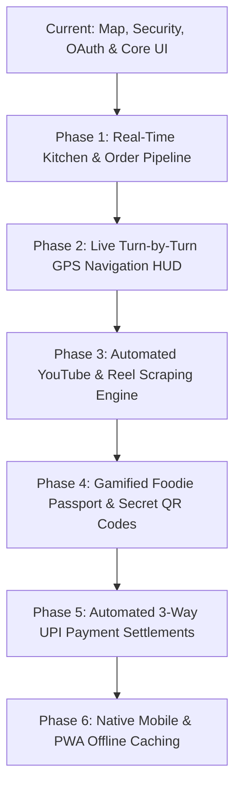

# 🗺️ Hidden Eats — Next Steps & In-Depth Implementation Roadmap

This document outlines the **exact, in-depth step-by-step technical plan** for the upcoming features, architecture upgrades, and deployment milestones across the **Hidden Eats** ecosystem.

---

## 📋 Executive Roadmap Overview

---

## 🚀 Phase 1: Real-Time Kitchen Display System (KDS) & Order Pipeline
**Goal:** Replace mock order states with an instant, bi-directional real-time order stream connecting Diners, Kitchens, and Drivers.

### Step 1.1: Supabase Realtime Channel Subscription
- **Action**: Bind `apps/web/src/app/dashboard/kitchen/page.tsx` and diner checkout to Supabase Postgres Realtime replication (`orders` table).
- **Events**:
  - `INSERT`: New incoming order rings audio alert in the kitchen & prints digital KOT (Kitchen Order Ticket).
  - `UPDATE (status = 'PREPARING')`: Diner UI updates live progress bar with preparation countdown.
  - `UPDATE (status = 'READY_FOR_PICKUP')`: Driver notification dispatched automatically with 4-digit handover OTP.

### Step 1.2: Kitchen Live Kitchen Action Bar
- **Action**: Add 1-tap quick action buttons in `KitchenPage`:
  - **"Accept & Start (15m)"**
  - **"Ready for Driver Dispatch"**
  - **"Item 86 (Out of Stock)"** (triggers instant menu de-listing).

---

## 🧭 Phase 2: Live Turn-by-Turn GPS Navigation HUD
**Goal:** Enhance the MapLibre & OSRM map into a full interactive in-app driving & walking navigation Heads-Up Display.

### Step 2.1: Live GPS Watch Position Stream
- **Action**: Use `navigator.geolocation.watchPosition` to smoothly interpolate the user's live coordinates across the MapLibre canvas using `turf.js` bearing math.
- **Features**:
  - Auto-rotate camera to match phone heading/compass (`map.setBearing()`).
  - Dynamic 3D pitch tilt (60° tilt in navigation mode).

### Step 2.2: OSRM Turn-by-Turn Maneuver Overlay
- **Action**: Parse `steps` and `maneuvers` from OSRM response:
  - Visual directional arrows (Turn Left in 200m on Anna Salai).
  - Live distance & ETA remaining counter.
  - Audio cues for upcoming turns.

---

## 🎬 Phase 3: Automated YouTube & Reel Location Extraction Engine
**Goal:** Convert food vlogger videos and Instagram reels into mapped hidden gems automatically using AI.

### Step 3.1: Video Metadata & Transcript Fetcher
- **Action**: Implement backend serverless handler in `apps/web/src/app/api/scrape-youtube/route.ts`:
  - Fetch video subtitles / auto-generated captions via YouTube v3 API.
  - Extract spoken Tamil / Tanglish / English / Hindi transcripts.

### Step 3.2: Named Entity Recognition (NER) & Geocoding
- **Action**: Parse transcripts using LLM / NER pipeline:
  - Extract: `[Shop Name]`, `[Landmark / Street]`, `[Signature Dish]`, `[Price Range]`.
  - Forward extracted landmark to OpenStreetMap Nominatim / Google Places Geocoding API to resolve exact `(latitude, longitude)`.
  - Automatically persist to `scraped_hidden_shops` table with `confidence_score`.

---

## 🏆 Phase 4: Gamified Foodie Passport & Secret QR Codes
**Goal:** Drive diner engagement with Bitmoji customizers, secret off-menu unlocks, and badge achievements.

### Step 4.1: Secret Off-Menu QR Code Scanner
- **Action**: Build mobile camera scanner modal on `/explorer`:
  - When diners visit a physical restaurant and scan the hidden table QR code, it unlocks the restaurant's **"Off-Menu Secret Dish"** and awards **+50 Gem XP**.

### Step 4.2: Bitmoji Foodie Avatar Customizer
- **Action**: Build visual avatar generator in `apps/web/src/app/dashboard/profile/page.tsx`:
  - Customize hat, sunglasses, chef jacket, and signature dish icon.
  - Save SVG / JSON config to `profiles.bitmoji_config`.

---

## 💳 Phase 5: Automated 3-Way UPI Payment Settlement
**Goal:** Implement real-time split payments with 1-tap UPI deep linking.

### Step 5.1: Dynamic BharatQR / UPI Deep Link Generation
- **Action**: Integrate dynamic UPI intent links (`upi://pay`):
  - Automatically generate QR codes with dynamic amounts and unique merchant reference (`HE_ORDER_XXXXX`).
  - Mobile diners clicking **"Pay via UPI"** automatically open GPay, PhonePe, or Paytm.

### Step 5.2: Instant 3-Way Revenue Split Calculation
- **Action**: Enforce revenue distribution formula:
  - **85%** -> Restaurant Partner Account.
  - **10%** -> Delivery Partner.
  - **5%** -> Platform Commission & Gem Rewards.

---

## 📱 Phase 6: PWA Offline Caching & Mobile App Build
**Goal:** Enable offline map viewing, instant push notifications, and Expo mobile compilation.

### Step 6.1: Service Worker Offline Tile Caching
- **Action**: Configure `next-pwa` / workbox caching in `apps/web/src/lib/pwa.ts`:
  - Pre-cache MapLibre vector/raster dark tiles for active city radius.
  - Cache restaurant photos and menus for offline browsing.

### Step 6.2: Mobile App Sync (`apps/mobile`)
- **Action**: Sync web UI components and state stores with the React Native Expo mobile codebase in `apps/mobile/src/screens/`.

---

## 🗓️ Recommended Implementation Order

| Priority | Phase | Estimated Timeline | Primary Impact |
| :--- | :--- | :--- | :--- |
| 🥇 **P1** | **Phase 1: Real-Time Kitchen & Order Pipeline** | 1–2 Days | Live interactive ordering between diners and kitchens |
| 🥈 **P2** | **Phase 2: Live Turn-by-Turn GPS HUD** | 1–2 Days | Immersive in-app navigation to hidden food spots |
| 🥉 **P3** | **Phase 3: YouTube NLP Location Scraper** | 2–3 Days | Automated catalog expansion from viral food reels |
| 🎖️ **P4** | **Phase 4: Foodie Passport & Secret QR Codes** | 1–2 Days | User retention, gamification, and social virality |
| 🎖️ **P5** | **Phase 5: UPI Deep Links & Auto-Settlements** | 1–2 Days | Frictionless payment checkout in India & global |
| 🎖️ **P6** | **Phase 6: PWA Offline & Mobile Sync** | 2 Days | App Store / Play Store readiness and offline speed |

---

> [!TIP]
> Each step when implemented will be logged as an individual record in [`/history`](file:///c:/Hidden%20Eats/history) to maintain a complete audit trail without modifying unrelated code.
