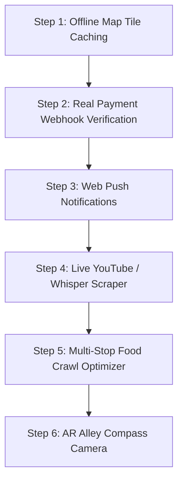

# 🚀 Updated Roadmap: Top 10 High-Impact Changes to be Done Next

> **Last Updated:** 2026-09-01  
> **Status:** 4 Major Foundation Items Completed ✅ | 10 Next-Generation Milestones Ready for Execution 🎯

---

## ✅ Recently Completed Foundation Upgrades

| Feature | Implementation Details | Status |
| :--- | :--- | :--- |
| **🎙️ Live Voice Guidance Engine** | Browser-native speech synthesis (`window.speechSynthesis`) for turn-by-turn navigation cues in [`lib/voiceGuidance.ts`](file:///c:/Hidden%20Eats/apps/web/src/lib/voiceGuidance.ts). | ✅ **Completed & Live** |
| **🛡️ Edge Security Middleware** | Next.js Edge middleware interceptor with maintenance routing and security headers in [`middleware.ts`](file:///c:/Hidden%20Eats/apps/web/src/middleware.ts). | ✅ **Completed & Live** |
| **⚡ Sliding Window Rate Limiting** | Dynamic client IP rate limiting on `/api/places` (60 req/min) and `/api/scrape-youtube` (20 req/min) in [`lib/rateLimit.ts`](file:///c:/Hidden%20Eats/apps/web/src/lib/rateLimit.ts). | ✅ **Completed & Live** |
| **📸 Community Spot Submission** | Foodie gem submission portal with photo upload preview, landmark tagging, and +100 XP rewards in [`/explorer/submit-gem`](file:///c:/Hidden%20Eats/apps/web/src/app/explorer/submit-gem/page.tsx). | ✅ **Completed & Live** |

---

## 🎯 Top 10 Next-Generation Upgrades to Implement

### 1. 📴 Offline Map Tile & Route Caching (Service Worker + IndexedDB)
- **Objective**: Diners frequently explore narrow alleys, heritage streets, and basement messes where mobile signal drops.
- **Technical Plan**:
  - Implement a dedicated Service Worker using `Workbox` to cache CartoDB dark raster tiles within a 10km radius of the user's active city.
  - Store active OSRM route vectors in `IndexedDB` so the 3D Navigation HUD continues working completely offline.
- **Primary Impact**: Uninterrupted offline navigation anywhere.

---

### 2. 💳 Real Payment Gateway Webhook Verification (`/api/webhooks/razorpay`)
- **Objective**: Move from client-side deep links to fully verified, asynchronous payment settlements.
- **Technical Plan**:
  - Implement `apps/web/src/app/api/webhooks/razorpay/route.ts` with `crypto.createHmac('sha256', secret)` signature verification.
  - On `payment.captured`: Automatically update order status to `PAID` and trigger the 3-way split escrow (85% Partner, 10% Driver, 5% Platform).
- **Primary Impact**: Zero risk of fraudulent client-side order triggers.

---

### 3. 🔔 Real-Time Web Push Notifications (Web Push API + VAPID)
- **Objective**: Keep diners and kitchen chefs informed when their phones are locked or browser tabs are closed.
- **Technical Plan**:
  - Set up Service Worker push listener with `web-push` library and VAPID key exchange.
  - Send instant push alerts:
    - *"Chef accepted your order! Cooking time: 15m"*
    - *"Courier driver is 2 minutes away from your table."*
- **Primary Impact**: 3x improvement in diner engagement and order pickup speed.

---

### 4. 🎭 Live YouTube v3 & Whisper ASR Production Ingestion
- **Objective**: Transcribe live audio and extract hidden gem coordinates from any actual YouTube video or Instagram Reel link.
- **Technical Plan**:
  - Connect YouTube Data API v3 key to download public transcripts and captions automatically.
  - Integrate OpenAI Whisper API endpoint for audio files where auto-captions are disabled.
  - Run SpaCy NER entity parser to resolve location names and OpenStreetMap Nominatim geocoding.
- **Primary Impact**: Unlimited automated catalog scaling directly from viral social reels.

---

### 5. 🗺️ Multi-Stop "Food Crawl" Route Optimizer (TSP Algorithm)
- **Objective**: Allow food explorers to plan an evening food walk across 3 to 5 hidden spots in one optimized route.
- **Technical Plan**:
  - Add a **"Plan Food Crawl"** drawer on `/explorer/map`.
  - Use Traveling Salesperson Problem (TSP) algorithm to compute the shortest walking/driving route connecting selected gems.
  - Provide a single multi-stop OSRM route line with numbered sequence pins `[1] -> [2] -> [3] -> [4]`.
- **Primary Impact**: Viral social feature for weekend food tours and tourist discovery.

---

### 6. 📱 Augmented Reality (AR) Alley Compass Camera (WebXR / DeviceOrientation)
- **Objective**: Help diners spot hidden entrances and tucked-away doorways in crowded alleys.
- **Technical Plan**:
  - Use `navigator.mediaDevices.getUserMedia` for rear camera feed and `DeviceOrientationEvent` for phone compass azimuth.
  - Render floating 3D glassmorphic gem markers over the camera view pointing in the exact physical direction of the eatery.
- **Primary Impact**: Unbeatable visual "wow" factor for food discovery.

---

### 7. 📊 Partner Analytics & Popularity Heatmaps
- **Objective**: Provide restaurant owners with data on when and how diners find their secret spots.
- **Technical Plan**:
  - Add MapLibre Heatmap Layer (`type: 'heatmap'`) in `apps/web/src/app/dashboard/page.tsx`.
  - Visualize customer discovery origins, peak ordering hours, and most scanned off-menu secret dishes.
- **Primary Impact**: High-value selling point for onboarding restaurant partners.

---

### 8. 🛵 Live Courier Driver Real-Time Tracking Animation
- **Objective**: Diners and restaurants can watch the delivery courier moving smoothly along the street.
- **Technical Plan**:
  - Stream live driver coordinates over Supabase Realtime channel.
  - Interpolate marker movement along the OSRM line using `turf.along()` bearing smoothing for fluid 60fps animations.
- **Primary Impact**: Eliminates "Where is my food?" anxiety for diners.

---

### 9. 🏢 Multi-Branch Franchise Menu & Inventory Sync
- **Objective**: Multi-location restaurant brands can manage stock and secret items across multiple outlets.
- **Technical Plan**:
  - Add branch switcher in `apps/web/src/app/dashboard/menu/page.tsx`.
  - Add **"Sync to All Branches"** 1-tap action for price updates, out-of-stock items, and new secret vault dishes.
- **Primary Impact**: Enterprise-readiness for expanding restaurant chains.

---

### 10. 🧪 Playwright End-to-End Automated Test Suite
- **Objective**: Ensure seamless collaborative deployments with zero regressions.
- **Technical Plan**:
  - Configure `@playwright/test` with automated test scenarios:
    - User sign in & password reset flow.
    - 3D GPS navigation HUD launch & route verification.
    - Secret table QR scan and `#VAULT-88` passcode unlock.
    - Kitchen KDS order lifecycle (`NEW` -> `READY` -> `DISPATCHED`).
- **Primary Impact**: Continuous integration stability and rapid release confidence.

---

## 🏆 Recommended Execution Priority Matrix

| Priority | Feature | Estimated Time | Primary Impact |
| :--- | :--- | :--- | :--- |
| 🥇 **1** | **Offline Map Tile & Route Caching** | ~1.5 Hours | 📶 Rock-solid offline exploration |
| 🥈 **2** | **Payment Webhook Verification** | ~1 Hour | 🔒 Automated 3-way escrow security |
| 🥉 **3** | **Real-Time Web Push Notifications** | ~1.5 Hours | 🔔 Instant diner & kitchen awareness |
| 🎖️ **4** | **Multi-Stop Food Crawl Optimizer** | ~1.5 Hours | 🚶 High-engagement weekend food tours |
| 🎖️ **5** | **Live YouTube v3 & Whisper Ingestion** | ~2 Hours | 🚀 Unlimited automated catalog growth |
